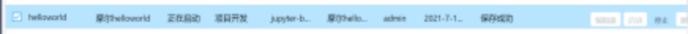

# 二. 开发环境

## 2.1 环境列表

登陆摩尔平台，选择左侧的<开发环境>导航栏，单击<环境列表>，打开<环境列表>页面。环境页面可提供给用户创建一个基础的codeserver环境，启动成功后在编辑器进行环境搭建及代码开发，项目完成后可保存为新的镜像；或者关联已有的项目镜像，对其底层代码或结构进行改造开发。

在环境列表中可以进行基本新增、编辑、删除环境；同时还包括启动环境、停止环境、编辑环境内部代码、查看日志以及保存环境为新的镜像功能。

## 2.2 新增环境

点击<新增>按钮，弹窗填写环境信息，完成环境添加。

a. 环境名称一般填写英文名称，可包含数字。

b. 环境类型分为数据标注、项目开发两类。

c. 选择关联镜像，可关联镜像包括codeserver和jupyter类型，先根据镜像名称选择，再根据版本选择。

d. 资源限制则为运行环境中创建的开发环境资源限制，运行环境创建参考<[5.1.2添加运行环境](https://yunzhihui.feishu.cn/docs/doccnmJewZbIMjOavPYXoJ8ZrEe#zWLkfm)>。

e. 是否保存开发结果，是则会生成相应标注数据集文件，在文件列表中可进行查看。

f. 是否保存训练模型，是则会生成相应模型结果文件，在文件列表中可进行查看。

g. 文件字段则可选择关联的文件列表中的文件。

h. 端口id集合则是为当前环境添加Service端口，包括容器内端口、服务对外端口以及node端口，以便于用户进行调试。

## 2.3 编辑环境

点击每条数据后的<编辑>按钮，在弹出的编辑页面进行环境信息的修改，注意：修改后需重启环境才可生效，环境名称不可修改。

## 2.4 删除环境

点击每条数据后的<删除>可进行单条数据的删除；如需进行批量删除，则勾选需要删除的数据，点击右上角<删除>按钮，进行批量删除操作。

## 2.5 启动环境

环境新建完成，点击数据操作列中的<启动>，可启动环境，点击后环境变为启动中状态。

环境启动成功后，可在点击编辑器，进入在线编辑环境进行开发。启动过程中可点击操作列中的<查看日志>，查看当前环境的启动信息。

环境启动成功后，可通过返回的ip及新建环境时填写的端口号进行调试。

## 2.6 停止环境

环境启动成功后，点击数据操作列中的<停止>按钮，环境状态变为未启动，可停止当前环境，环境停止后，<编辑器>按钮则不可点击。

## 2.7 编辑器

环境启动成功后，点击数据操作列中的<编辑器>按钮，密码为123456，即可进入编辑器进行代码开发。

